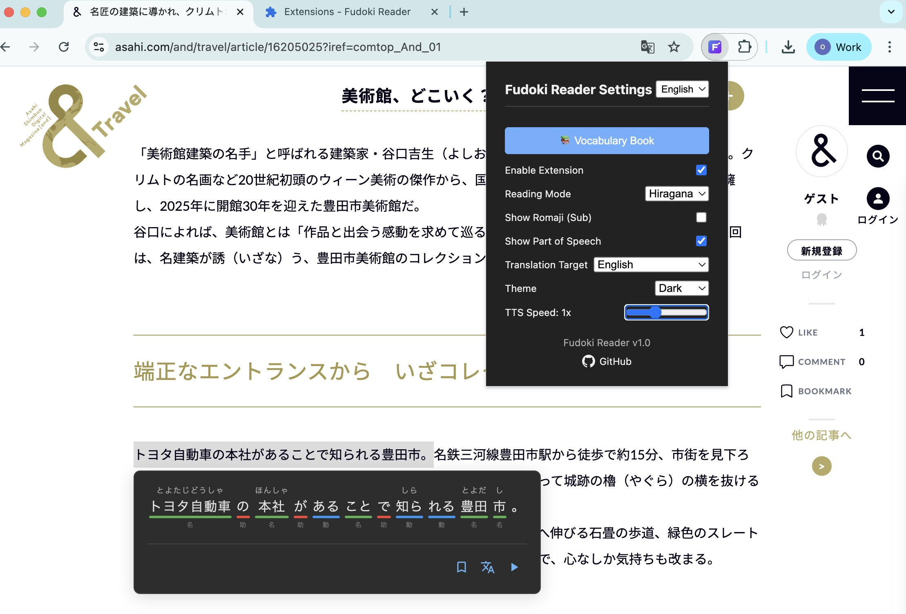
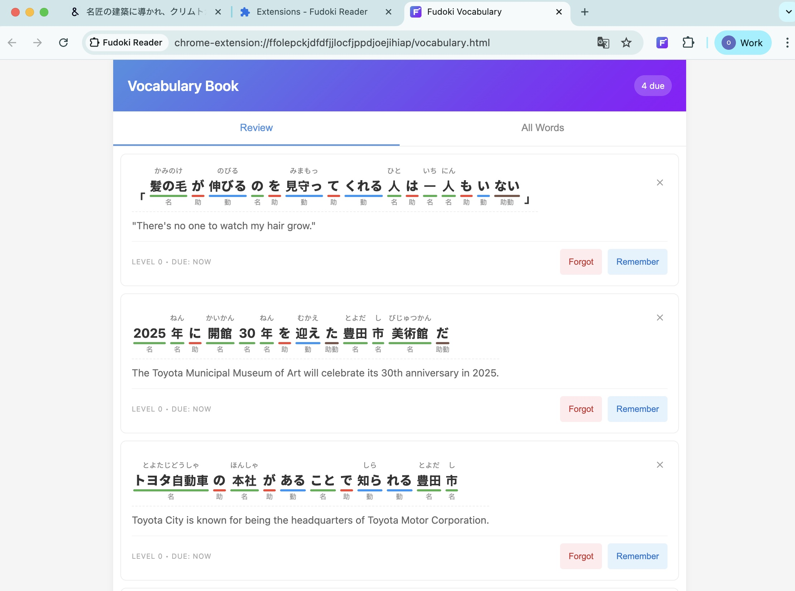

# Fudoki Reader (Extension)

An interactive Japanese text analysis and speech synthesis Chrome Extension.

日本語を「見える化」する Chrome 拡張機能（テキスト解析＆音声読み上げ）

让日语结构可视化的 Chrome 扩展（文本分析与语音朗读）

[](https://chromewebstore.google.com/detail/fudoki-reader/nkjanfhhhmammefnfeenbeioiodhbkij)



## English

### Overview
Fudoki Reader is a Chrome Extension that segments Japanese text, shows part-of-speech tags and readings, and reads text aloud via the Web Speech API. It brings the power of [Fudoki](https://github.com/iamcheyan/fudoki) directly to your browser popup.

### Features
*   **Text Analysis**: Kuromoji.js-based segmentation, POS tags, kana, and romaji.
*   **Dictionary**: Built-in JMDict integration; click a word to view translations.
*   **Vocabulary Book**: Save words with context and review them using a built-in SRS (Spaced Repetition System).
*   **Advanced Speech Synthesis**: Read text aloud with adjustable speed (0.1x–1.5x), karaoke-style highlighting, and granular controls (Play/Pause, Restart, Previous/Next Word).
*   **Offline Capable**: All analysis and dictionary lookups happen locally within the extension.
*   **Theme Support**: Light, Dark, and System theme modes.

### Usage
1.  Clone or download this repository.
2.  Open Chrome and navigate to `chrome://extensions/`.
3.  Enable **Developer mode** (toggle in the top right corner).
4.  Click **Load unpacked** and select the `extension` folder from this repository.
5.  Click the Fudoki Reader icon in your toolbar to open the popup and analyze text.

---

## 日本語

### 概要
Fudoki Reader は、ブラウザで動作する日本語テキスト解析・音声読み上げ Chrome 拡張機能です。Kuromoji.js による分かち書き、品詞、読み（かな・ローマ字）を表示し、Web Speech API で朗読します。[Fudoki](https://github.com/iamcheyan/fudoki) の機能をブラウザのポップアップで直接利用できます。

### 主な機能
*   **形態素解析**: 分割、品詞、読み（かな／ローマ字）を表示。
*   **辞書機能**: JMdict と連携、単語をクリックして訳語を表示。
*   **単語帳**: 文脈付きで単語を保存し、内蔵のSRS（間隔反復システム）で復習できます。
*   **高度な音声合成**: 読み上げ速度（0.1–1.5倍）の調整、カラオケ風のハイライト表示、詳細な再生コントロール（再生/一時停止、リスタート、前/次の単語）に対応。
*   **オフライン対応**: 解析と辞書検索はすべてローカルで行われます。
*   **テーマ対応**: ライト、ダーク、システム設定に追従するテーマ切り替え。

### 使い方
1.  このリポジトリをクローンまたはダウンロードします。
2.  Chrome で `chrome://extensions/` を開きます。
3.  右上の **デベロッパーモード** を有効にします。
4.  **パッケージ化されていない拡張機能を読み込む** をクリックし、このリポジトリの `extension` フォルダを選択します。
5.  ツールバーの Fudoki Reader アイコンをクリックして使用します。

---

## 中文

### 概述
Fudoki Reader 是一款基于浏览器的日语文本分析与语音朗读 Chrome 扩展。使用 Kuromoji.js 进行分词与词性标注，显示假名和罗马音，并通过 Web Speech API 朗读文本。它将 [Fudoki](https://github.com/iamcheyan/fudoki) 的强大功能带到了您的浏览器弹窗中。

### 功能
*   **文本分析**: 分词、词性、假名与罗马音显示。
*   **内置词典**: 整合 JMdict；点击单词即可查看释义。
*   **生词本**: 保存单词及其上下文，并使用内置的 SRS（间隔重复系统）进行复习。
*   **高级语音合成**: 支持朗读文本，可调节语速 (0.1–1.5x)，支持卡拉OK式高亮显示，并提供精细控制（播放/暂停、重新开始、上/下个单词）。
*   **离线可用**: 所有分析和词典查询均在本地完成。
*   **主题支持**: 支持浅色、深色及跟随系统的外观模式。

### 使用方法
1.  克隆或下载本仓库。
2.  在 Chrome 中打开 `chrome://extensions/`。
3.  开启右上角的 **开发者模式**。
4.  点击 **加载已解压的扩展程序**，选择本仓库中的 `extension` 文件夹。
5.  点击工具栏中的 Fudoki Reader 图标即可使用。

---

### Part-of-Speech Colors / 品詞色分け / 词性颜色

| Color | POS | 日本語 | 中文 |
| :--- | :--- | :--- | :--- |
| 🟢 | Noun | 名詞 | 名词 |
| 🔵 | Verb | 動詞 | 动词 |
| 🟠 | Adjective | 形容詞 | 形容词 |
| 🟣 | Adverb | 副詞 | 副词 |
| 🔴 | Particle | 助詞 | 助词 |
| 🟡 | Interjection | 感動詞 | 感叹词 |

### Build & Packaging

To package the extension for distribution (Chrome Web Store):

1.  Install dependencies:
    ```bash
    npm install
    ```
2.  Run the build script:
    ```bash
    npm run build
    ```
    This will create a `dist/` folder containing the minified code and a zip file.

### Development

```
fudoki-reader/
├── extension/          # Chrome Extension source code
│   ├── manifest.json
│   ├── background.js
│   ├── content.js
│   ├── popup.html
│   └── static/
│       └── libs/
│           └── dict/   # Dictionary data (JMdict)
└── README.md
```

### License and Third-party
*   MIT License
*   Kuromoji.js — Apache License 2.0
*   JMdict — Creative Commons Attribution-ShareAlike 3.0

### Special Thanks / 特别感谢

This project is heavily inspired by and based on the core logic of **[Fudoki](https://github.com/iamcheyan/fudoki)**.

Special thanks to **[iamcheyan](https://github.com/iamcheyan)** for the amazing work on the original web-based tool. This extension aims to make those excellent features accessible directly from the browser toolbar.

本プロジェクトは **[Fudoki](https://github.com/iamcheyan/fudoki)** のコアロジックに基づいています。素晴らしいオリジナルのWebツールを開発された **[iamcheyan](https://github.com/iamcheyan)** 氏に特別の感謝を捧げます。

本项目基于 **[Fudoki](https://github.com/iamcheyan/fudoki)** 的核心逻辑开发。特别感谢 **[iamcheyan](https://github.com/iamcheyan)** 开发了如此出色的 Web 工具。本扩展旨在让这些优秀功能在浏览器工具栏中触手可及。

### Name Origin / 名称の由来 / 名称由来

**English**
Fudoki is named in homage to Japan’s ancient regional gazetteers “Fudoki”. “Fudo” conveys the atmosphere and character of place and culture; “Ki” means to record. This app similarly “records the climate of language”—prosody, rhythm, phonology, and grammar—by segmenting text, labeling parts of speech and readings, and reassembling it for spoken output.

**日本語**
この名称 フドキ は、奈良時代の地誌『風土記（ふどき）』へのオマージュです。「風土」＝地域や文化の空気感・肌ざわり、「記」＝記すこと、記録すること。このアプリは、まさに「言葉の風土」を記録し、見える化するための道具です。

**中文**
Fudoki（フドキ） 的名字向日本奈良时代的古代地志《风土记》致敬。「风土」＝地域与文化的气息与肌理，「记」＝记录、书写。本应用做的，正是“记录语言的风土”：把句子拆解成词语，标注词性与读音，让语言的风土逐步显形。
